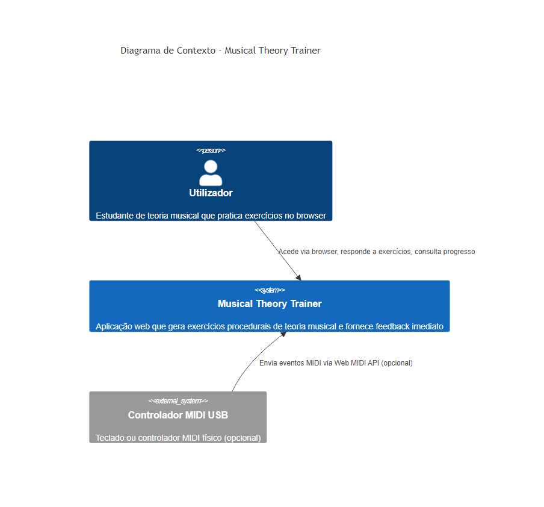
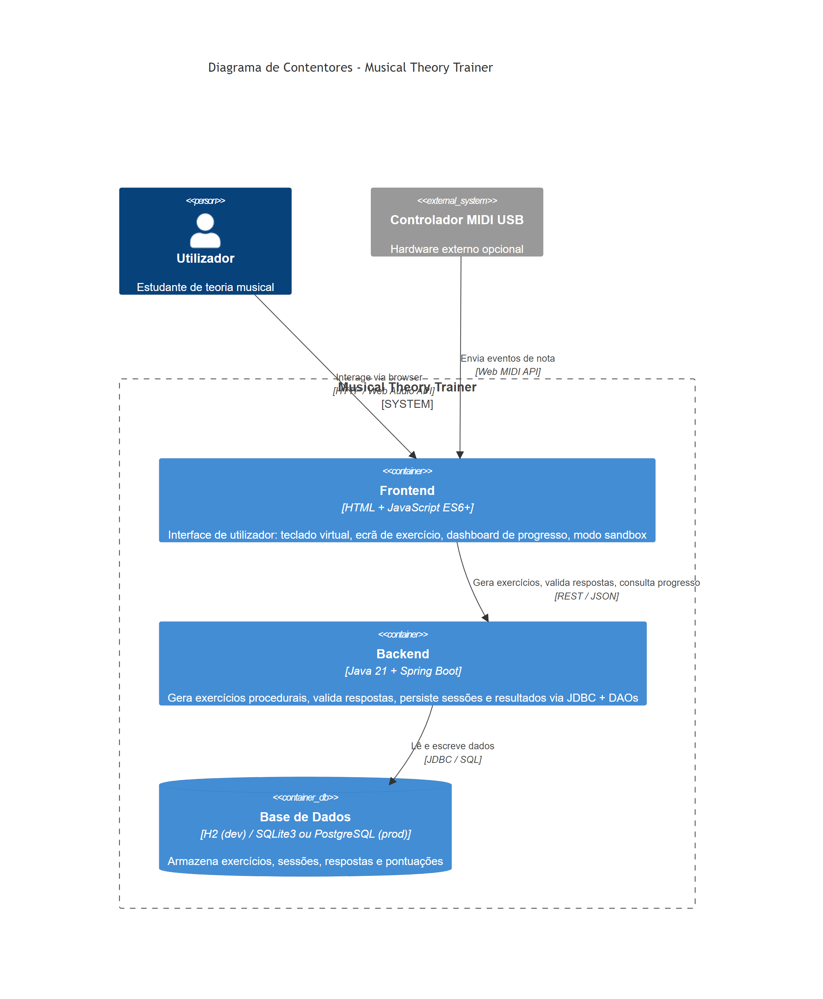
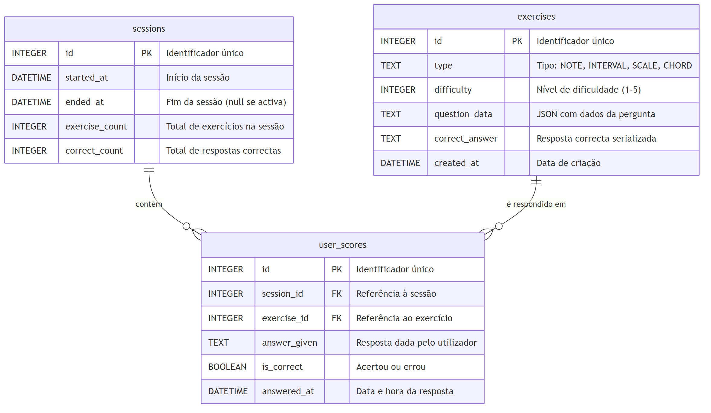

# Relatório Intercalar - Musical Theory Trainer

**Unidade Curricular:** 21184 - Projeto de Engenharia Informática 2025/26
**Estudante:** Daniel Junior - 2304335
**Orientador:** Pedro Duarte Pestana
**Instituição:** Universidade Aberta
**Data:** Maio 2026

---

## Capítulo 1 - Introdução

### 1.1 Descrição do Projeto

O Musical Theory Trainer é uma aplicação web de treino auditivo para teoria musical.
O mote que despoletou o projeto foi simples: um Duolingo para teoria musical. Mas rapidamente
percebi que a múltipla escolha não era adequada para o que queria construir - não treina
realmente o ouvido, apenas o reconhecimento de opções.

O resultado foi um sistema onde o utilizador ouve uma estrutura musical - um intervalo, uma
escala, um acorde - e responde tocando as notas num teclado virtual (ou num controlador MIDI
físico). A aplicação avalia automaticamente e devolve feedback imediato. O funcionamento foi
pensado para ser simples e sem atrito:

- arranca com um único comando
- corre em qualquer browser moderno sem instalação adicional
- uma sessão pode ser completada em menos de 5 minutos
- não há login, não há subscrição, não há gamificação forçada

Há apenas o exercício e o feedback.

---

### 1.2 Necessidades Identificadas

Aprender teoria musical é um obstáculo frequente para músicos autodidactas e estudantes em
turmas numerosas. O problema não é a falta de recursos - temos: livros, vídeos, aplicações,
etc. O problema é a falta de uma verificação personalizada que sirva para construir a
segurança e a auto-estima do estudante.

Num mundo perfeito, este feedback seria imediato e ajudaria diretamente o desenvolvimento
de competências musicais. Confirmar se um intervalo é mesmo uma 5ª Perfeita, ou se um acorde
é menor, precisa de alguém de fora que conheça esses conceitos - normalmente um professor.
Que raramente está disponível em tempo real durante a prática de exploração musical, aquela
que realmente reforça o aprendizado e expande o conhecimento. Refiro-me ao momento privado
e informal, sem o rigor da prática musical observada.

O resultado é que conceitos fundamentais ficam imprecisos durante anos. Esta imprecisão
limita a capacidade de improvisar, ler partituras e comunicar musicalmente. É como aprender
a andar de bicicleta com as rodinhas sempre colocadas: a insegurança leva à pouca exploração
prática, e a práticas repetitivas e mecânicas acabam por ser infrutíferas.

---

### 1.3 Âmbito

**Dentro do âmbito:**

- Exercícios de identificação de intervalos, escalas (Maior, Menor Natural, Menor Harmónica
  em níveis iniciais; modos diatónicos e escalas adicionais desbloqueados progressivamente
  com o nível de dificuldade) e tríades (maior, menor, diminuto, aumentado)
- Teclado virtual clicável com reprodução de som via Web Audio API
- Suporte a controlador MIDI físico USB, com detecção automática (Web MIDI API)
- Avaliação automática com feedback imediato (correto/errado + resposta correta se errado)
- Sessões de treino com persistência de resultados entre utilizações
- Dashboard de progresso por tipo de exercício e identificação de padrões de erro
- Dificuldade adaptativa baseada nos últimos 100 exercícios por tipo
- Modo sandbox: tocar livremente e ver o nome das notas e intervalos em tempo real

**Fora do âmbito (esta versão):**

- Autenticação ou gestão de múltiplos utilizadores (CB01, CB02)
- Ditado rítmico (CB05)
- Versão mobile nativa - aplicação web exclusivamente (CB06)
- Progressões de acordes - reservadas para versão futura
- Reconhecimento de áudio por microfone

---

### 1.4 Objetivos

Os critérios de aceitação observáveis do MVP estão organizados em nove objetivos:

- **F01** - Modelo de domínio musical amplo, mas não exaustivo: `Note`, `Interval`, `Scale`,
  `Chord`, com todos os casos verificados por testes unitários
- **F02** - Geração procedural de exercícios dos três tipos (intervalos, escalas, acordes),
  sem repetição consecutiva (mesmo exercício) na mesma sessão
- **F03** - Teclado virtual _clicável_ no browser (C3 a C5 em mobile, C2 a C6 em desktop),
  com reprodução de som via Web Audio API
- **F04** - Input via controlador MIDI físico com detecção automática, sem configuração manual
- **F05** - Avaliação automática com feedback imediato: correto/errado e resposta correta quando
  errado, em menos de 200ms em ambiente local
- **F06** - Feedback sonoro distinto para acerto e para erro
- **F07** - Persistência de sessões e histórico de resultados entre reinícios da aplicação
- **F08** - Dashboard de progresso com taxa de acerto por tipo de exercício e identificação
  dos padrões onde o utilizador tem pior desempenho
- **F09** - Dificuldade adaptativa: incrementa se taxa de acerto >= 80%, decrementa se < 40%,
  janela de 100 exercícios por tipo para evitar oscilações por variância em amostras pequenas

---

### 1.5 Restrições

As principais restrições que condicionaram as decisões de design e implementação:

| ID | Restrição |
|---|---|
| CB01 | Sem autenticação nem login |
| CB02 | Base de dados para um único utilizador implícito |
| CB05 | Sem ditado rítmico - fora do âmbito desta versão |
| CB06 | Aplicação web; sem versão mobile nativa |
| CB07 | Frontend em HTML e JavaScript ES6+ vanilla - sem frameworks |
| CB11 | Design visual não é prioridade - interface funcional e clara |
| RNF01 | Backend: Java 21 + Spring Boot, JDBC puro sem ORM |
| RNF06 | Tempo de resposta da validação < 200ms em ambiente local |

Para a lista completa de restrições e constraints, ver `docs/scope/requirements.md`.

---

### 1.6 Resultados Esperados

O resultado esperado é uma aplicação web funcional que arranca com um único comando
(`mvn spring-boot:run`), corre no browser sem instalação adicional, e permite a qualquer
utilizador completar uma sessão de exercícios de teoria musical em menos de 5 minutos.
O sucesso é verificável: se a aplicação gera exercícios, valida respostas corretamente,
toca som, aceita input MIDI e regista progresso - o objetivo está atingido.

À data deste relatório intercalar (2 de maio de 2026), o backend está implementado e
revisto: 230 testes a passar, todos os requisitos Must-have verificados. Na semana 8 foi
realizada uma auditoria abrangente do backend contra os contratos documentados nos ADRs e
requisitos, que identificou e corrigiu inconsistências - entre elas o facto de o gerador de
escalas ignorar o sistema de dificuldade e a presença de um campo de múltipla escolha na API
que contradizia o protocolo de resposta por notas MIDI. O frontend foi desenhado e especificado
- wireframes produzidos (ver `docs/design/wireframes.pdf`), decisões de arquitetura documentadas
nos ADRs 017 e 018 - e a implementação está agendada para as semanas 9 a 12.

A API REST está documentada e testável interactivamente via Swagger UI, disponível em
`http://localhost:8080/swagger-ui.html` após arranque da aplicação. Esta interface foi
usada ao longo do desenvolvimento para verificação manual dos endpoints e foi o principal
instrumento da auditoria realizada na semana 8.

---

### 1.7 Alterações face à Proposta Original

Durante a implementação, alguns parâmetros da proposta foram revistos. Documento-os aqui
com a justificação respetiva.

#### 1.7.1 Nomenclatura dos tipos de exercício

Os tipos `SCALE_IDENTIFICATION` e `CHORD_IDENTIFICATION` foram simplificados para `SCALE`
e `CHORD` durante a implementação do modelo de domínio. O sufixo `_IDENTIFICATION` era
redundante - todos os exercícios são de identificação. O critério de aceitação permanece
o mesmo; apenas o valor do campo `type` na API mudou.

#### 1.7.2 Janela do algoritmo adaptativo: 10 -> 100 exercícios

A proposta original previa uma janela de 10 exercícios para calcular a taxa de acerto.
Optei por alargar para 100 porque, com apenas 10 amostras, uma sequência de 3 acertos
consecutivos podia inflar artificialmente a dificuldade - provocando oscilações não
representativas do nível real do utilizador. 100 exercícios por tipo fornecem uma taxa
de acerto estatisticamente mais significativa e reduzem a variância aleatória. Ver ADR-015.

#### 1.7.3 Escala de dificuldade: 1-5 -> 1-10

Ampliei a escala de dificuldade de 1-5 para 1-10. Convenceu-me a granularidade mais fina:
+1/-1 num espaço de 10 é uma progressão mais gradual do que num espaço de 5. Além disso,
a biblioteca alargada de tipos de escala (28 valores) precisava de mais bandas para uma
classificação com significado pedagógico. Ficaram 5 bandas semânticas: BEGINNER, ELEMENTARY,
INTERMEDIATE, ADVANCED, EXPERT. Ver ADR-015 para a taxonomia completa.

#### 1.7.4 Localização da lógica adaptativa: frontend -> backend

A proposta original colocava a lógica de adaptação de dificuldade no frontend, com estado
local dos últimos resultados. Movi-a para o backend. Penso que faz mais sentido centralizar
a lógica de negócio no servidor:

- garante consistência entre sessões
- elimina a possibilidade de estado local corrompido no browser
- evita que a lógica seja contornada client-side

O `DifficultyService` implementa o algoritmo; o frontend recebe `suggestedDifficulty` na
resposta de `generate` como sugestão informativa.

#### 1.7.5 Refinamentos da API identificados em auditoria pré-intercalar

Na semana 8, antes de redigir este relatório, foi feita uma auditoria abrangente do backend
contra os contratos documentados. Dois refinamentos relevantes resultaram desta revisão:

O campo `options` foi removido da resposta de geração de exercícios. Este campo era um
resquício do design original de múltipla escolha e contradizia o protocolo de resposta
baseado em notas MIDI definido na arquitectura - o utilizador toca as notas, não selecciona
de uma lista. A sua presença era uma inconsistência entre o código e o contrato documentado.

O domínio de escalas foi expandido para além das três escalas do MVP original (Maior, Menor
Natural, Menor Harmónica). O enum `ScaleType` classifica 28 tipos de escala em bandas de
dificuldade; o gerador passou a usar esta classificação correctamente, desbloqueando modos
diatónicos (Dórico, Frígio, Lídio, etc.) a partir do nível ADVANCED e escalas exóticas no
nível EXPERT. Esta expansão foi documentada depois, no ADR-019, durante a auditoria da semana 8.

---

### 1.8 Calendário Atualizado

O calendário original foi seguido com uma exceção: a semana 5 teve produtividade reduzida
por sobreposição com a Páscoa e a entrega de eFólios de outras unidades curriculares
(risco R04, identificado na proposta). O backend foi concluído na semana 8, dentro do
prazo previsto para o intercalar.

| Semanas | Datas         | Realizado / Planeado                                                                                                                                                                                                                                                                                                                          | Marco                   |
|---|---------------|-----------------------------------------------------------------------------------------------------------------------------------------------------------------------------------------------------------------------------------------------------------------------------------------------------------------------------------------------|-------------------------|
| Sem. 1-2 | 17-28 mar     | Kick-off com orientador. Proposta entregue: sinopse, MVP com critérios de aceitação, stack, calendário.                                                                                                                                                                                                                                       | **✅ Proposta (25 mar)** |
| Sem. 3-4 | 31 mar-11 abr | Levantamento de requisitos MoSCoW (RF01-RF14, RNF, CB, OI). ADRs 001-011 formalizados. Diagramas C4 e modelo de dados. Repositório GitHub configurado.                                                                                                                                                                                        | -                       |
| Sem. 5 | 14-18 abr     | Produtividade reduzida - Páscoa e eFólios concorrentes (risco R04).                                                                                                                                                                                                                                                                           | -                       |
| Sem. 6 | 21-25 abr     | Fase 2 - Persistência: DTOs, DAOs JDBC, 24 testes de integração. Suporte multi-base-de-dados. ADR-012.                                                                                                                                                                                                                                        | -                       |
| Sem. 7 | 28 abr-2 mai  | Fase 3-4 - Geradores de exercícios e REST API completa. 171 testes. ADR-013, ADR-014. Demo interna ao orientador não ocorreu. Estou atrasado e não contactei o orientador. RF07 (persistência), RF08 (dashboard), RF09 (dificuldade adaptativa). Auditoria abrangente do backend e correcção de inconsistências. Backend revisto. 230 testes. | **❌ Demo interna**      |
| Sem. 8 | 3-6 mai       | Relatório intercalar. Test funcionais com Swagger para garantir funcionamento antes de começar implementação do UI. Tentar agendar demo interna.                                                                                                                                                                                              | **Intercalar (6 mai)**  |
| Sem. 9-10 | 7-16 mai      | Fase 5-6 - Frontend: teclado virtual, Web Audio API, Web MIDI API, ecrã de exercício.                                                                                                                                                                                                                                                         | -                       |
| Sem. 11-12 | 19-30 mai     | Fase 7 - Dashboard de progresso, ecrã de fim de sessão. Testes de integração.                                                                                                                                                                                                                                                                 | -                       |
| Sem. 13 | 2-6 jun       | Revisão geral. Validação de todos os critérios de aceitação. Capturas de ecrã para Cap. 4.                                                                                                                                                                                                                                                    | -                       |
| Sem. 14 | 9-13 jun      | Cap. 4 (Testes) e Cap. 5 (Conclusões). Revisão bibliográfica APA. Anexos.                                                                                                                                                                                                                                                                     | -                       |
| Sem. 15 | 16-20 jun     | Reunião de preparação para defesa. Ensaio de perguntas de júri.                                                                                                                                                                                                                                                                               | **Prep. defesa**        |
| Sem. 16 | 24 jun        | Submissão do relatório final. Código e demo linkados no repositório.                                                                                                                                                                                                                                                                          | **Final (24 jun)**      |

---

## Capítulo 2 - Desenho

### 2.1 Stack Tecnológica

A selecção tecnológica foi orientada por dois princípios: reduzir dependências
externas ao mínimo e usar tecnologias com experiência prévia existente.

| Componente | Tecnologia | Justificação |
|---|---|---|
| Backend | Java 21 + Spring Boot 3.3 | Experiência prévia; Spring Boot minimiza configuração de infraestrutura; JDBC puro sem ORM mantém controlo explícito das queries SQL (ADR-010) |
| Frontend | HTML + JavaScript ES6+ vanilla | Sem experiência prévia com frameworks - React ou Vue adicionariam curva de aprendizagem desproporcional para o scope do projeto (ADR-008) |
| Áudio | Web Audio API (nativa) | Zero dependências externas; funciona em qualquer browser moderno sem instalação adicional; suficiente para sintetizar notas isoladas (ADR-004) |
| MIDI | Web MIDI API (nativa) | Zero dependências; detecção automática de controladores USB; o backend é agnóstico à origem da nota - MIDI ou teclado virtual produzem o mesmo tipo de resposta (ADR-005) |
| Base de dados (dev) | H2 in-memory | Arranca sem configuração; schema recriado a cada reinício; consola web integrada para inspecção durante desenvolvimento (ADR-007) |
| Base de dados (prod) | SQLite3 | Zero configuração de servidor, ficheiro único portátil, adequado para aplicação single-user; decidido em OI01 (ADR-001) |
| Build | Maven | Standard no ecossistema Java/Spring; gestão de dependências madura e estável |

---

### 2.2 Arquitectura C4 - Nível 1 (Contexto)

O sistema Musical Theory Trainer é uma aplicação web standalone. Não há sistemas
externos de autenticação, APIs de terceiros nem serviços de armazenamento remoto.
A única dependência externa opcional é um controlador MIDI físico ligado por USB,
cujos eventos são capturados directamente pelo browser via Web MIDI API.

*Figura 1: Diagrama de contexto C4 - utilizador, sistema e controlador MIDI externo.*

---

### 2.3 Arquitectura C4 - Nível 2 (Contentores)

A aplicação divide-se em três contentores: o frontend (HTML + JS vanilla), o backend
(Spring Boot) e a base de dados (H2 em desenvolvimento, SQLite3 em produção). O
frontend comunica com o backend exclusivamente via REST/JSON. O backend persiste dados
via JDBC/SQL. O frontend é servido pelo mesmo processo Spring Boot, a partir da
directoria `/frontend/` configurada em `application.properties` (ADR-017).

*Figura 2: Diagrama de contentores C4 - frontend, backend e base de dados.*

---

### 2.4 Modelo de Dados

O modelo de dados tem três tabelas: `exercises`, `sessions` e `results`.

- `exercises` - regista cada exercício gerado: tipo (INTERVAL, SCALE, CHORD),
  dificuldade (1-10), `question` (JSON com dados da pergunta, schema em ADR-013)
  e `correct_answer` (array de notas MIDI esperadas em JSON)
- `sessions` - ciclo de vida de uma sessão de treino: `start_time`, `end_time`
  (null se activa), contadores atómicos `total_exercises`, `correct_answers`,
  `incorrect_answers`
- `results` - regista cada resposta: FK para sessão e exercício, `user_answer`
  (notas MIDI tocadas em JSON), `is_correct`

A FK `results.session_id` usa ON DELETE CASCADE - apagada a sessão, os resultados
são apagados. Quando `session_id = 0` (SESSION_NONE, ADR-014), a resposta é avaliada
mas não persistida - modo sandbox.

*Figura 3: Diagrama entidade-relação - exercises, sessions e results.*

---

### 2.5 Algoritmos Principais

#### 2.5.1 Dificuldade Adaptativa (RF09)

O `DifficultyService` calcula a dificuldade sugerida com base nos últimos 100
exercícios completados do mesmo tipo:

    entrada: tipo T, dificuldade actual D
    1. buscar os últimos 100 resultados onde exercises.type = T
    2. taxa_acerto = correctos / total
    3. se taxa_acerto >= 0.80  → sugerir D + 1
       se taxa_acerto < 0.40   → sugerir D - 1
       senão                   → sugerir D
    4. clamp: sugestão entre 1 e 10
    5. effectiveDiff = clamp(sugestão, D - 2, D + 2)
    6. retornar effectiveDiff e sugestão informativa ao frontend

A janela de 100 exercícios evita oscilações por variância em amostras pequenas -
com 10 exercícios, 3 acertos consecutivos podiam inflar artificialmente a dificuldade.

#### 2.5.2 Identificação de Padrões Fracos (RF08)

O `ProgressService` identifica os padrões onde o utilizador tem pior desempenho:

    1. SELECT type, questionJson, COUNT(*) total, SUM(is_correct) correctos
       FROM results JOIN exercises ON exercise_id = id
       GROUP BY type, questionJson
       HAVING COUNT(*) >= 3
       ORDER BY (correctos * 1.0 / COUNT(*)) ASC
       LIMIT 10
    2. para cada linha: extrair padrão do questionJson por tipo
       INTERVAL → IntervalType.fromSemitones(|notes[1] - notes[0]|).internalName()
       SCALE    → questionJson.type
       CHORD    → questionJson.type
    3. WeaknessHintProvider.getHint(type, padrão) → dica pedagógica PT-PT

O limiar de 3 tentativas evita que um único erro apareça com 0% de acerto.

#### 2.5.3 Geração Procedural de Exercícios

Os exercícios são gerados inteiramente a partir do modelo de domínio, sem datasets:

    entrada: tipo T, dificuldade D
    1. banda = DifficultyLevel.of(D)
    2. tipos_disponíveis = T.availableFor(banda).filter(!isAlias)
    3. tipo_escolhido = random(tipos_disponíveis)
    4. raiz = escolher nota MIDI por banda:
       se banda <= ELEMENTARY: raiz ∈ notas brancas (C3-B4)
       senão: raiz ∈ [C2, C5] cromático
    5. objecto = domain.get(tipo_escolhido, Note.fromMidi(raiz))
    6. questionJson = serialize(raiz, tipo_escolhido)
    7. notesToPlay = objecto.getNotes() + [raiz + 12] se escala
    8. guardar em BD e devolver ao frontend

---

### 2.6 Padrões de Design

#### Strategy (GoF)

`ExerciseGenerator` é uma interface que define o contrato de geração e reconstrução
de exercícios. `IntervalExerciseGenerator`, `ScaleExerciseGenerator` e
`ChordExerciseGenerator` implementam a interface independentemente. Adicionar um novo
tipo de exercício não requer alterar `GeneratorFactory` nem `ExerciseService`.
Ref: Gamma et al. (1994), pp. 315-323.

#### Factory Method (GoF)

`GeneratorFactory` encapsula a criação dos geradores e recebe `ObjectMapper` via
injecção de dependências Spring. `DaoFactory` faz o mesmo para os DAOs, recebendo o
`DataSource` correcto conforme o perfil activo (H2, SQLite, PostgreSQL). Os consumers
nunca instanciam directamente.
Ref: Gamma et al. (1994), pp. 107-116.

#### Data Access Object (Core J2EE Patterns)

`SessionDao`, `ExerciseDao` e `ResultDao` extendem `AbstractDao<T>`, que encapsula
a lógica de `Connection`, `PreparedStatement` e `ResultSet`. A camada de serviço
nunca escreve SQL. A decisão de não usar Spring Data JPA (ADR-010) mantém as queries
explícitas e controláveis.
Ref: Alur et al. (2003), pp. 462-475.

#### Value Object / Record (DDD)

As entidades de domínio (`Note`, `Interval`, `Scale`, `Chord`) e os DTOs
(`SessionRecord`, `ExerciseRecord`, `ResultRecord`) são Java records imutáveis.
A imutabilidade elimina bugs de estado partilhado e simplifica o raciocínio sobre
o fluxo de dados.
Ref: Evans (2003), pp. 97-103.

#### Sentinel Value

`MusicConstants.SESSION_NONE = 0L` distingue o modo sandbox (sem persistência) de
uma sessão activa. O campo `sessionId` em `AnswerRequest` é primitivo `long` - quando
omitido no JSON, Jackson deserializa para 0L automaticamente. Sem nulls, sem validação
extra.

---

### 2.7 Wireframes

O protótipo de navegação está disponível em `docs/design/wireframes.pdf` (versão
interactiva em `docs/design/wireframes.html`).

A interface organiza-se em quatro ecrãs:

- **index.html** - ecrã principal: selector de tipo de exercício, dois modos de entrada
  (Praticar sem persistência, ou Iniciar sessão com registo), teclado virtual CSS e
  modal de ajuda
- **exercise.html** - ecrã de exercício activo: instrução por tipo, botão de áudio,
  teclado virtual, feedback após resposta (correcto/errado + resposta esperada)
- **session-end.html** - resumo de sessão: total de exercícios, taxa de acerto, barra
  de progresso, dica pedagógica da área mais fraca
- **progress.html** - dashboard: precisão global, breakdown por tipo, áreas mais fracas
  com dicas, histórico de sessões

As decisões de arquitectura do frontend estão documentadas em ADR-017 (deployment:
directoria `/frontend/` servida pelo Spring Boot) e ADR-018 (teclado CSS, range
C2-C6 desktop / C3-C5 mobile, breakpoints 768px e 1024px).

---

### 2.8 Decisões de Arquitectura

As decisões de arquitectura estão documentadas individualmente em
`docs/architecture/adr/`. Esta secção resume cada decisão com as alternativas
consideradas e as consequências principais.

#### ADR-001 - Arquitectura em 3 camadas

A aplicação divide-se em três camadas independentes: Frontend (HTML/JS vanilla), Backend
(Java/Spring Boot com API REST) e Persistência (H2 em desenvolvimento). A abordagem
monolítica com Thymeleaf foi rejeitada por misturar frontend e backend, dificultando a
avaliação independente de cada camada. A arquitectura de microserviços foi rejeitada por
introduzir complexidade desproporcional ao âmbito do projeto. A separação facilita
desenvolvimento paralelo e extensão futura sem alterar o backend.

#### ADR-002 - Backend agnóstico à origem do input

O backend recebe respostas musicais sempre pelo mesmo endpoint REST, independentemente de
virem do teclado virtual ou de um controlador MIDI físico. Endpoints separados por tipo
de input foram rejeitados por violar a separação de responsabilidades - a origem do input
é uma preocupação exclusiva da camada de apresentação. O frontend normaliza os eventos
heterogéneos para um callback único antes de chamar a API, mantendo o backend simples e
extensível para futuros tipos de input.

#### ADR-003 - Geração procedural de exercícios sem datasets externos

Os exercícios são gerados algoritmicamente a partir do modelo de domínio musical em
runtime, sem ficheiros de dados externos nem conteúdo estático pré-definido. Uma base de
dados de exercícios pré-definidos foi rejeitada por limitar a variedade e não demonstrar
que o modelo musical está correctamente formalizado. APIs externas de teoria musical foram
rejeitadas por introduzirem dependências fora do controlo do sistema e potencial violação
da restrição CB03. A abordagem garante variedade virtualmente infinita e deployment simples.

#### ADR-004 - Web Audio API para reprodução de som

O som é gerado no browser via Web Audio API nativa, usando síntese de osciladores com
frequência calculada por f = 440 * 2^((midiNumber - 69) / 12). Bibliotecas externas
como Tone.js e Howler.js foram rejeitadas por introduzirem dependências desnecessárias
para o scope. Ficheiros MP3/WAV por nota foram rejeitados por requererem 88 ou mais
ficheiros de áudio e violarem a restrição CB08. A decisão resulta em zero dependências
de áudio e controlo total sobre timbre e duração.

#### ADR-005 - Web MIDI API para input de hardware MIDI

O input de controladores MIDI físicos é capturado via Web MIDI API nativa do browser,
com graceful degradation em Safari (único browser moderno sem suporte). Plugins como
JazzPlugin foram rejeitados por serem obsoletos e incompatíveis com o objectivo de
funcionar no browser sem instalação. Um servidor MIDI via WebSocket foi rejeitado por
introduzir um terceiro processo com overhead desproporcional. RF04 foi classificado como
"Should have" para que a ausência de hardware não impeça a entrega.

#### ADR-006 - Java 21 + Spring Boot para o backend

O backend é implementado em Java 21 com Spring Boot, stack onde há experiência directa
de desenvolvimento. Node.js, Python/FastAPI e Quarkus foram rejeitados por exigirem curva
de aprendizagem onde já existe domínio em Java/Spring. O Spring Boot minimiza configuração
via auto-configuration e Tomcat embebido, e o ecossistema extenso garante documentação
disponível para qualquer decisão técnica.

#### ADR-007 - H2 para desenvolvimento; PostgreSQL ou SQLite3 para produção

Em desenvolvimento usa-se H2 (in-memory ou ficheiro), que permite iniciar sem qualquer
setup de base de dados e inclui consola web. PostgreSQL desde o inicio foi rejeitado por
exigir instalação antes de escrever a primeira linha de código. A decisão de produção
(PostgreSQL vs SQLite3) fica em aberto até antes da demo interna (OI01); com JDBC puro
a troca requer apenas alterar o driver e o schema.sql.

#### ADR-008 - JavaScript vanilla no frontend (sem frameworks)

O frontend é implementado em HTML e JavaScript ES6+ puro, sem frameworks (React, Vue,
Angular) e sem ferramentas de build (npm, Vite, Webpack). React e Vue foram rejeitados
por exigirem curva de aprendizagem com JSX, bundler e gestão de estado - complexidade
desproporcional ao scope com pouca experiência em frontend. A decisão mantém zero
ferramentas de build, código transparente para o júri, e compatibilidade com CB07.

#### ADR-009 - Estrutura de ecrãs: páginas HTML separadas

A navegação é feita com páginas HTML separadas servidas directamente pelo browser, sem
router em JavaScript. A abordagem SPA com router em JS puro foi rejeitada por exigir
gestão de histórico de browser e estado global - complexidade desnecessária para o nível
de experiência actual. SPA com framework viola CB07. As páginas actuais são index.html,
exercise.html, session-end.html e progress.html, cada uma autónoma e testável de forma
independente.

#### ADR-010 - DAO classes com JDBC puro em vez de Spring Data JPA

A camada de persistência usa classes DAO com JdbcTemplate e SQL explícito, sem anotações
@Entity, Hibernate, nem JpaRepository. Spring Data JPA foi rejeitado por introduzir
lazy loading, proxies e cache - comportamentos difíceis de controlar e de defender
perante o júri. O resultado é SQL visível e explícito em cada DAO, com DTOs implementados
como Java records imutáveis (Java 16+).

#### ADR-011 - TDD como metodologia de desenvolvimento

O projeto segue TDD (Red-Green-Refactor) em 85%+ do código de produção: nenhuma feature
é implementada sem um teste que falha primeiro, e nenhum bug é corrigido sem o reproduzir
em teste. Testes escritos após implementação foram rejeitados por não prevenirem regressões
com a mesma eficácia. O critério adoptado é que cada contrato funcional da aplicação tem
um teste correspondente, focado em comportamento esperado e não em edge cases raros.

#### ADR-012 - Modelo de dados e estratégia de persistência

O schema de persistência define tres tabelas - sessions, exercises e results - com chaves
estrangeiras e políticas de integridade referencial (CASCADE em sessions, SET NULL em
exercises). DAOs sem anotações Spring usam try-with-resources para gestão de conexões,
garantindo controlo total sobre cada operação. O histórico de resultados suporta
dificuldade adaptativa (RF09) via análise dos últimos 100 exercícios do mesmo tipo.

#### ADR-013 - Schema do campo question nos exercícios

O campo question na tabela exercises armazena JSON mínimo baseado em números MIDI: dois
MIDI para intervalos, raiz e tipo para escalas e acordes. Guardar todas as notas da
escala ou acorde foi rejeitado por ser redundante - o domínio é determinístico e
reconstrói as notas a partir de raiz e tipo. A decisão fecha o open item OI07 e garante
que geradores e controllers usam um schema consistente.

#### ADR-014 - Protocolo de resposta baseado em notas MIDI

O utilizador responde tocando notas, enviando um array de números MIDI ao endpoint de
resposta. O modelo anterior de resposta por nome textual foi rejeitado por reduzir o
exercício a escolha múltipla, eliminando a componente de performance musical. As regras
de validação variam por tipo: intervalos exigem MIDI exacto, escalas validam padrão de
intervalos independente de oitava, acordes validam padrão ascendente I-III-V independente
de oitava.

#### ADR-015 - Taxonomia de dificuldade para exercícios

Foi criado o enum DifficultyLevel com 5 bandas semânticas (BEGINNER a EXPERT) que
mapeiam a escala numérica 1-10. Cada tipo de exercício carrega o seu nível e os geradores
filtram via availableFor(DifficultyLevel), eliminando magic numbers. A alternativa de
manter inteiros sem semântica foi rejeitada por tornar RF09 (dificuldade adaptativa)
impossível de implementar de forma correcta e consistente. O DifficultyService centraliza
o algoritmo de adaptação baseado nos últimos 100 resultados por tipo.

#### ADR-016 - Contrato de Erros: RFC 7807 Problem Details

Todos os erros HTTP usam ProblemDetail (RFC 7807, nativo no Spring Boot 3) com um GlobalExceptionHandler central, eliminando try-catch disperso em cada controller. A alternativa de endpoints separados por tipo de erro foi rejeitada por violar separação de responsabilidades; manter formatos inconsistentes (plain text, JSON genérico, nada) foi rejeitado por tornar o parsing frontend impossível sem lógica ad-hoc. A centralização garante que todos os clientes HTTP - frontend, Swagger, Postman, integradores - conseguem parsear erros uniformemente e que novos endpoints herdam o comportamento automaticamente.

#### ADR-017 - Frontend: localização no repositório e integração com Spring Boot

Os ficheiros frontend ficam na directoria /frontend/ na raiz do repositório, servida pelo
Spring Boot via configuração em application.properties. Colocar o frontend em
src/main/resources/static/ foi rejeitado por acoplar a estrutura frontend ao layout Maven.
Repositório separado foi rejeitado por overhead injustificado para MVP académico com um
único developer. O URL do backend fica centralizado em js/api.js - uma linha para mudar
de ambiente em produção.

#### ADR-018 - Teclado virtual: range MIDI e design responsivo

O teclado virtual é implementado em CSS puro (flexbox e position:absolute para teclas
pretas) com tres breakpoints: mobile (25 teclas C3-C5), tablet (37 teclas C2-C5) e
desktop (49 teclas C2-C6). Um piano completo de 88 teclas foi rejeitado por ser inviável
em mobile (largura de 2464px). Imagem PNG com image map foi rejeitada por dificultar
highlight dinâmico e resize. O range desktop cobre todos os exercícios BEGINNER e
ELEMENTARY sem scroll, com breakpoints alinhados com Bootstrap 5 e Tailwind.

#### ADR-019 - Expansão do domínio de escalas além do MVP original

O enum ScaleType foi construido com 28 tipos de escala em vez dos 3 definidos no MVP,
desbloqueados progressivamente por DifficultyLevel. Manter apenas os 3 tipos originais
foi rejeitado por desperdiçar um modelo já construido sem beneficio pedagógico. A expansão
é invisível para utilizadores iniciantes (BEGINNER vê apenas MAJOR) e não exige mudança
de código no gerador para adicionar novos tipos. Esta ADR regulariza retroactivamente uma
decisão implementada em feat/13-25 sem registo prévio, identificada na auditoria de Sem. 8.

---

### 2.9 Referências

Alur, D., Crupi, J., & Malks, D. (2003). *Core J2EE Patterns: Best Practices and
Design Strategies* (2nd ed.). Prentice Hall.

Evans, E. (2003). *Domain-Driven Design: Tackling Complexity in the Heart of
Software*. Addison-Wesley.

Fowler, M. (2002). *Patterns of Enterprise Application Architecture*.
Addison-Wesley.

Gamma, E., Helm, R., Johnson, R., & Vlissides, J. (1994). *Design Patterns:
Elements of Reusable Object-Oriented Software*. Addison-Wesley.

Internet Engineering Task Force. (2016). *RFC 7807 - Problem Details for HTTP
APIs*. https://www.rfc-editor.org/rfc/rfc7807

Spring Team. (2024). *Spring Boot 3.3.0 Reference Documentation*.
https://docs.spring.io/spring-boot/docs/3.3.0/reference/html/

World Wide Web Consortium. (2021). *Web Audio API - W3C Recommendation*.
https://www.w3.org/TR/webaudio/

World Wide Web Consortium. (2015). *Web MIDI API - W3C Editor's Draft*.
https://www.w3.org/TR/webmidi/
